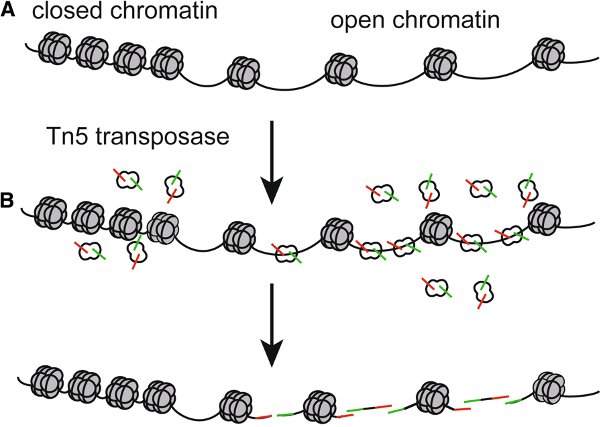
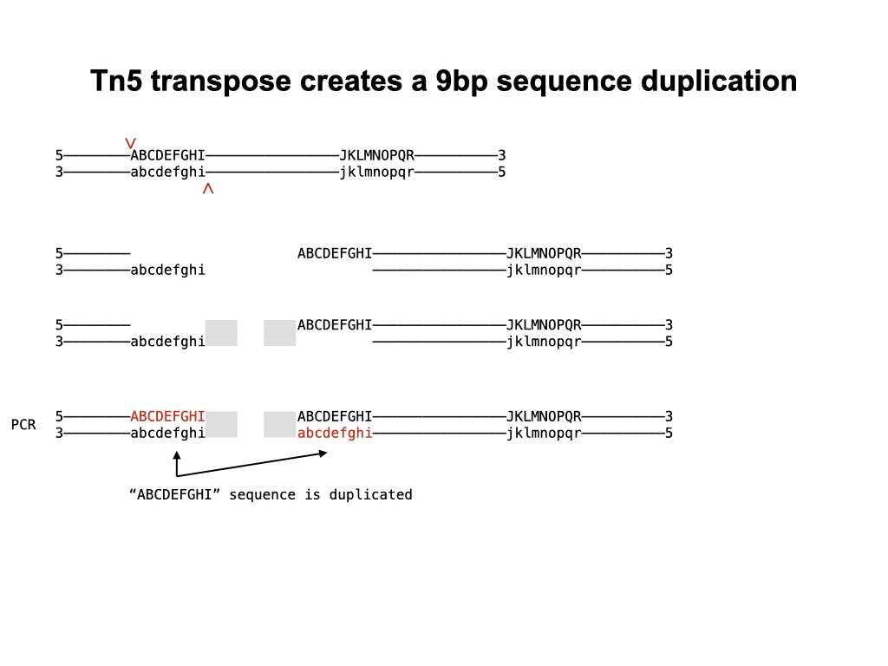
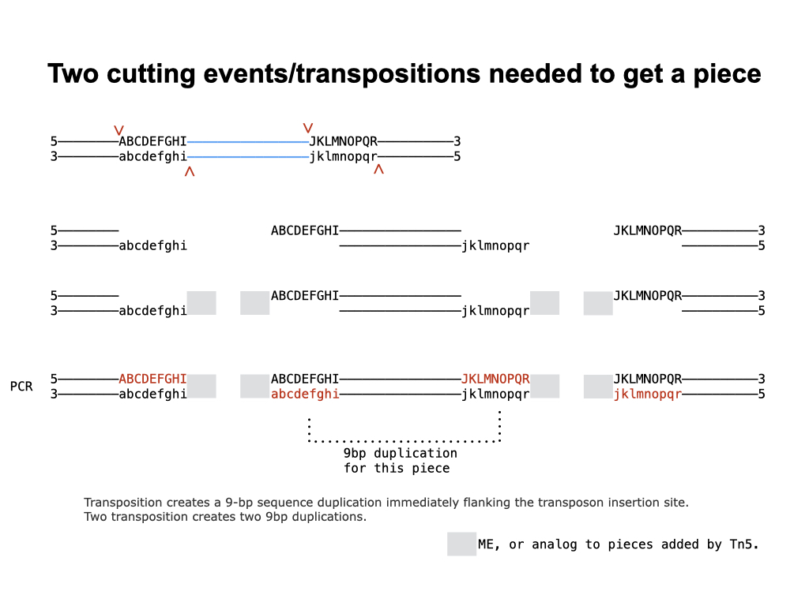
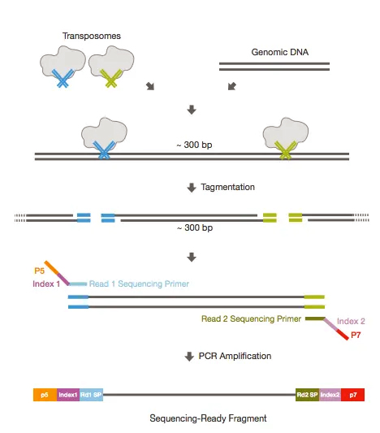

# <h1 align="center">Tn5 in scATAC-seq</h1>

## Function of Tn5 in scATAC-seq
**Assay for Transposase-Accessible Chromatin Sequencing (ATAC-Seq)** employs a hyperactive form of Tn5 transposase to identify regions of open chromatin, which are important for global epigenetic control of gene expression. Tn5 simultaneously cleaves and adds adapters to nucleosome-free regions of DNA, priming them for sequencing.
 
 

  

[Reference:biomedcentral](https://hereditasjournal.biomedcentral.com/articles/10.1186/s41065-019-0105-9)

***
**Qestions:**
Could the cutting site of Tn5 span more than 0 nucleosome?
***
 
## How does Tn5 cut?
Each transposition creates a 9bp duplication, this is the reason that the genomic position of the sequenced fragments was adjusted 5 or 4bp to get the center point of the cutting site.

  

  

***
**Qestions:**
How to locate the exact cutting site of Tn5?
***

[Reference:10X genomics](https://support.10xgenomics.com/single-cell-atac/software/pipelines/latest/output/fragments)
“The start of the interval is moved forward by 4bp from a left-most alignment position and backward 5bp from the right-most alignment position. The transposase cuts the two DNA strands with a 9bp overhang, and adjusted positions represent the center point between these cuts; this position is recorded as a cut site that represents a chromatin accessibility event.”

## Construct of equencing fragment after Tn5

  

[Reference:abpbio](https://www.abpbio.com/product/tn5-transposase/)

