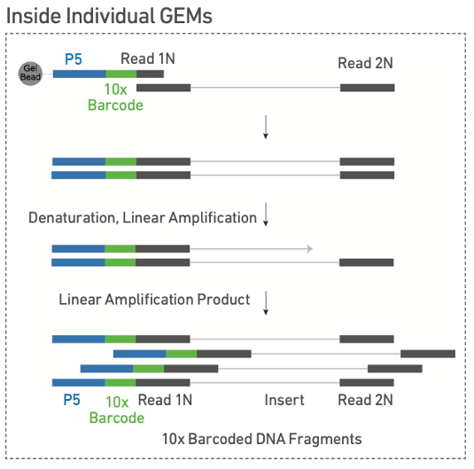
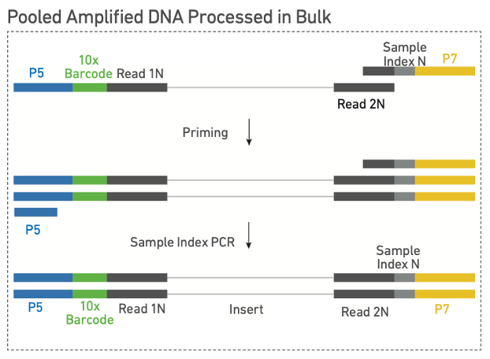
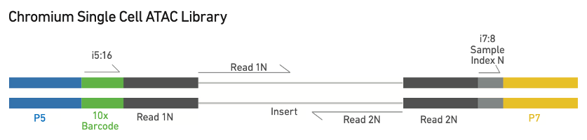
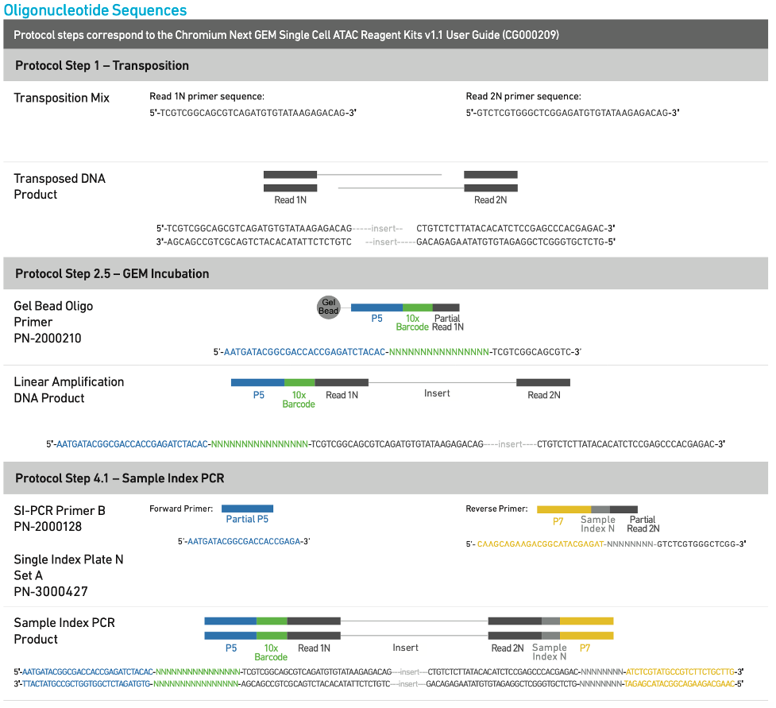

# <h1 align="center">10X genomics scATAC-seq Library Construction</h1>

## Main step I: barcoding

[Chromium Next GEM Single Cell ATAC Reagent Kits v1.1, 10X genomics, users guide.](https://assets.ctfassets.net/an68im79xiti/2NEwsG0Yu3RuxvtQiWXZo3/1e939394fa43a4f0bd88d79383833b16/CG000209_Chromium_NextGEM_SingleCell_ATAC_ReagentKits_v1.1_UserGuide_RevE.pdf)

This step synthesizes top single strands.

***
**Notes:**
scATAC-seq sequencing constructs don't have UMI sequence because it's a DNA sequencing methods, not like RNA sequencing that contain many RNA transcripts to differentiate.
***

## Main step II: library construction
P7 and a sample index are added during library construction via PCR. The final libraries contain the P5 and P7 sequences used in Illumina® bridge amplification.

## Main step III: sequencing

## Overview and oligo sequences

